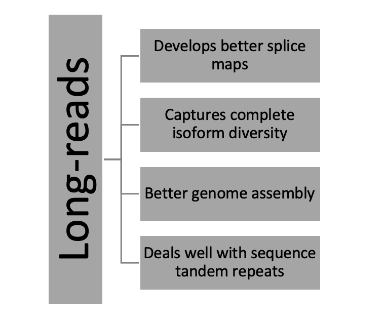

# About the Project

Developed scripts assess assembly of StringTie for short-reads and direct long-reads by checking presence of transcripts, extract transcripts from GTF files with transcript classification codes. Aligned transcripts generated by StringTie back to genome and quantify reads for each transcript.

---

Fred Sanger in 1977 first described sequencing with addition of dideoxyribonucleotides (ddNTPs) to a growing DNA strand and terminating it on incorporation of the fluorescently tagged ddNTPs. This produced multiple overlapping segments of DNA; with single-base substitution of ddNTPs at each position. Although this method has 99% accuracy, it can sequence strands less than 1,000 nucleotides in length. To overcome that, second generation sequencers adapted newer advance sequencing methods such as pyrosequencing, ion torrent sequencing, 454 sequencing, Solexa sequencing, SOLiD sequencing, etc. The second-generation sequencers generate millions of short reads faster in relatively economical way as compared to the first-generation sequencers. However, short reads generated by second generation sequencers do not offer precise genome assembly because of the presence of repetitive regions in the genome. The short-reads produced do not span over two exons making it difficult to generate splice maps and to find out variants. Second generation sequencers are incapable of detecting variations affecting sequences longer than 50bps (Chaisson). Moreover, sequence tandem repeats at telomere and centromere (Bailey) as well as atypical GC content affects coverage by short reads generated by second generation sequences. Third-generation sequences address this issue by producing long reads of several kilobases.

Third-generation sequencers such as Pacific bioscience SMRT sequencing, Oxford nanopore sequencing offer better genome assembly, detection of rare variants by generating long reads. These sequencers produce sequences of 10 kilobases and more in cost-efficient manner to address repeat structures as well as reconstruction of genome assembly. 
RNA-Seq analysis is undeniably important tool for transcriptomic data analysis with wide range of applications from differential gene expression analysis, variant identification to genome assembly. Wang et al. (2008) suggests that more than 90% of human genes are alternatively spliced to form isoforms. Long reads can sequence isoforms whereas this information may be complex to gain from short reads. Therefore, long reads can capture complete isoform diversity. Pacific Biosciences (PacBio) and Oxford Nanopore (ONT) are dominant in long read sequencing which can sequence 50 kilobases at a time. Nanopore sequencing technology (Jain) can sequence RNA directly without modification, cDNA synthesis and/or PCR amplification during library preparation required in other sequencing techniques called as long-read direct RNA sequencing. 
Recent advances in long-reads demand for RNA-Seq analysis tools to analyze long read segments along with traditional short-reads. StringTie2 is a transcript assembler for short reads and long reads and has claims to have better accuracy and sensitivity as compared to other transcript assemblers. In this project, we assess coverage of long-reads and short reads using Stringtie2.

## Methods

Samples: Short-reads: RNA-Seq data was obtained from poly mRNA RNA-Seq of GM12878 on Illumina platform. GM12878 is an immortalized lymphoblastoid cell line produced from the blood of a female donor.

Long-reads: Direct long-reads of the same cell line was used.
Hisat2 was used to align short-reads which outputted a SAM file. Samtools were used to sort the SAM and convert it to BAM file required for the processes ahead. We ran StringTie2 on the resulting BAM to assemble the reads. Tracking file produced by StringTie was filtered with `filter_for_classcode.py` to only filter transcripts exactly matching (=). To check exact matches we developed ‘check_transcripts.py’ to generate an excel sheet showing presence of each transcript found in short-reads, long-reads or merged.  

StringTie assembled long-reads were aligned back to the direct long-read sequences using gffread generating FASTA sequences of the assembled transcripts. Minimap2 was used to check coverage of transcripts by quantifying number of long-reads aligned the transcript.

---

Use it as :
### Filter_For_Classcode :

This code inputs tracking file (generated by gffcompare) and transcript classification code (class code) and filter for reads with the specified transcript classification code writing it in an output file. User can filter with any class code specified in the GffCompare Utility.
Run it as:
`filter_for_classcode.py --file= “some.tracking”  --class_code= “=”  --output= “output.txt”`

---

### Minimap_Evaluation : 

For file generated after minimap evaluation. Divide big data sample into specified size and generate multiple small files. Extract sequence and calculate length of sequences and append into DataFrame.
Run it as:
`python minimap_evaluation.py`

---

### check_Transcript
Run it as:
`python check_transcript.py`